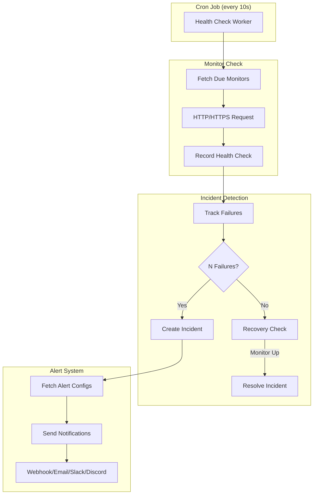

## Architecture

```mermaid
flowchart TD
    subgraph Cron["Cron Job (every 10s)"]
        A[Health Check Worker]
    end
    
    subgraph Monitor["Monitor Check"]
        B[Fetch Due Monitors]
        C[HTTP/HTTPS Request]
        D[Record Health Check]
    end
    
    subgraph Incident["Incident Detection"]
        E[Track Failures]
        F{N Failures?}
        G[Create Incident]
        H[Recovery Check]
        I[Resolve Incident]
    end
    
    subgraph Alerts["Alert System"]
        J[Fetch Alert Configs]
        K[Send Notifications]
        L[Webhook/Email/Slack/Discord]
    end
    
    A --> B
    B --> C
    C --> D
    D --> E
    E --> F
    F -->|Yes| G
    F -->|No| H
    H -->|Monitor Up| I
    G --> J
    J --> K
    K --> L
```