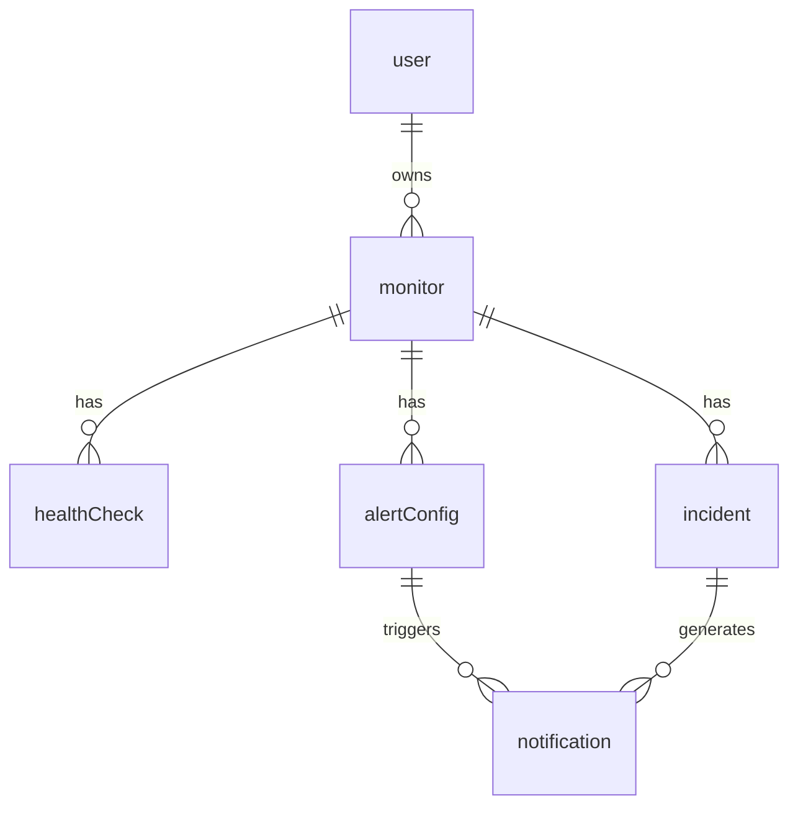

```mermaid
erDiagram
    user ||--o{ monitor : owns
    monitor ||--o{ healthCheck : has
    monitor ||--o{ incident : has
    monitor ||--o{ alertConfig : has
    alertConfig ||--o{ notification : triggers
    incident ||--o{ notification : generates
```
